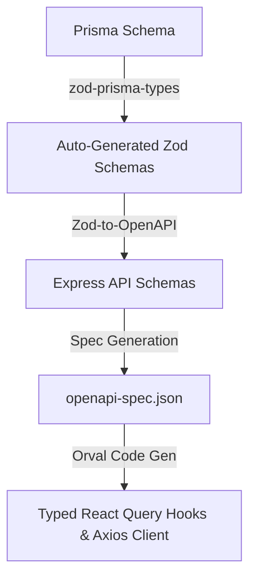

# Monorepo Template

A batteries-included monorepo template for fullstack TypeScript projects. Clone it, run the setup script, and start building your app.

## What's included

| Layer           | Technology                                                                                    |
| --------------- | --------------------------------------------------------------------------------------------- |
| API             | Express 5, Prisma 7 (PostgreSQL), session auth, Zod-to-OpenAPI validation, Swagger UI         |
| Web             | React 19, Vite, TanStack Router, TanStack Query (React Query), Orval API clients, Tailwind v4 |
| Design system   | Storybook 10                                                                                  |
| Shared packages | UI library, ESLint config, Prettier config, Tailwind config, TypeScript config, Vitest config |
| Infrastructure  | Docker Compose (dev + prod), multi-stage Dockerfiles                                          |

## Prerequisites

- [Node.js](https://nodejs.org) ≥ 20 (enforced via `.nvmrc`)
- [pnpm](https://pnpm.io) ≥ 10 (enforced in `package.json`)
- [Docker](https://docker.com) with Compose

## Getting started

### 1. Use this template

Click **Use this template** on GitHub, or clone directly:

```bash
git clone <repo-url> my-project
cd my-project
```

### 2. Run the setup script

```bash
pnpm run setup
```

This will prompt you for:

- **Project name** — e.g. `my-app`
- **Package scope** — e.g. `mycompany` (becomes `@mycompany`)

The script renames all `@template` references throughout the codebase and runs `pnpm install`.

### 3. Configure environment

```bash
cp apps/api/.env.sample apps/api/.env
# Edit apps/api/.env — set DATABASE_URL, ACCESS_TOKEN_SECRET, etc.
```

### 4. Start the database and run migrations

```bash
docker compose up postgres -d
docker compose exec api-dev pnpm --filter @<scope>/api migrate
```

### 5. Start development

```bash
docker compose up api-dev web-dev
```

| Service       | URL                                                               |
| ------------- | ----------------------------------------------------------------- |
| Web app       | http://localhost:9000                                             |
| API           | http://localhost:3001                                             |
| API Docs      | http://localhost:3001/docs (Interactive Swagger UI)               |
| OpenAPI Spec  | http://localhost:3001/openapi.json (Raw OpenAPI 3.0 spec)         |
| Storybook     | http://localhost:6006 (run `docker compose up design-system-dev`) |
| Prisma Studio | http://localhost:5555 (run `docker compose up prisma-studio`)     |

## Monorepo structure

```
.
├── apps/
│   ├── api/               # Express API (auth + users)
│   │   ├── prisma/        # Schema and migrations
│   │   └── src/
│   │       ├── controllers/
│   │       ├── middleware/
│   │       ├── routes/
│   │       └── services/
│   ├── web/               # React web app
│   │   └── src/
│   │       ├── components/
│   │       ├── features/
│   │       ├── providers/
│   │       └── routes/
│   └── design-system/     # Storybook
│       └── stories/
├── packages/
│   ├── ui/                # Shared React component library
│   ├── eslint-config/     # Shared ESLint config
│   ├── prettier-config/   # Shared Prettier config
│   ├── tailwind-config/   # Shared Tailwind config
│   ├── typescript-config/ # Shared tsconfig presets
│   └── vitest-config/     # Shared Vitest config
├── scripts/
│   └── setup.mjs          # One-time project initialisation
└── docker-compose.yml
```

## Adding new API routes

1. Create `apps/api/src/routes/your-resource.ts`
2. Create corresponding controller and service files
3. Mount the router in `apps/api/src/routes/index.ts`
4. Add any new models to `apps/api/prisma/schema.prisma` and run `pnpm --filter @<scope>/api migrate`

## Adding new UI components

1. Create the component in `packages/ui/src/components/`
2. Export it from `packages/ui/src/index.ts`
3. Add a story in `apps/design-system/stories/components/`

## Adding new packages

1. Create a directory under `packages/`
2. Add a `package.json` with name `@<scope>/your-package`
3. The pnpm workspace will pick it up automatically

## Production builds

```bash
docker compose up web          # Web app at http://localhost:8080
docker compose up design-system # Storybook at http://localhost:8081
docker compose up api          # API at http://localhost:3000
```

## Code Generation Pipeline

We have established a fully automated end-to-end type safety and code-generation pipeline that connects our database, backend validations, OpenAPI schema, and frontend client hooks.



### Running the pipeline

When you modify the database schema or your API validation schemas, you can regenerate the entire stack (schemas, spec, and frontend clients) with a single command from the monorepo root:

```bash
pnpm generate
```

- **Backend spec only**: To compile the OpenAPI spec without rebuilding database clients, run `pnpm openapi:generate`.
- **Prisma types**: Database schemas are auto-generated under `@template/schemas` to enable compile-time type-safety across packages.

---

## API Client & Design Document Sync (Insomnia)

To make testing and debugging endpoints extremely easy, our complete API design document is checked into version control inside this repository.

- **Setup Native Git Sync**: We use native Insomnia Project-level Git Sync to track request collections, query schemas, and environment variables.
- **Instructions**: For a step-by-step walkthrough on how to set up your credentials, import the OpenAPI spec, and push/pull requests, refer to [Insomnia Integration & Git Sync Guide](file:///Users/lee-work/ts-fullstack-monorepo-template/docs/insomnia-setup.md).

---

## Startup Environment Validation

The API service validates all required environment variables at boot time using a strict Zod schema. If any required variables (e.g. `DATABASE_URL`, `JWT_SECRET`, or `SESSION_SECRET`) are missing or incorrectly formatted, the API server will fail-fast with a descriptive validation error at startup.

---

## GitHub template

To mark this repo as a GitHub template so others can use it:

1. Go to **Settings** → check **Template repository**
2. Users can then click **Use this template** to create a new repo from it
